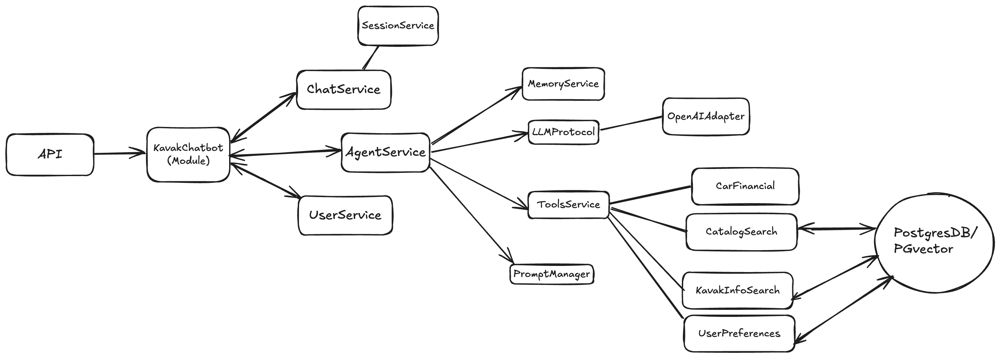
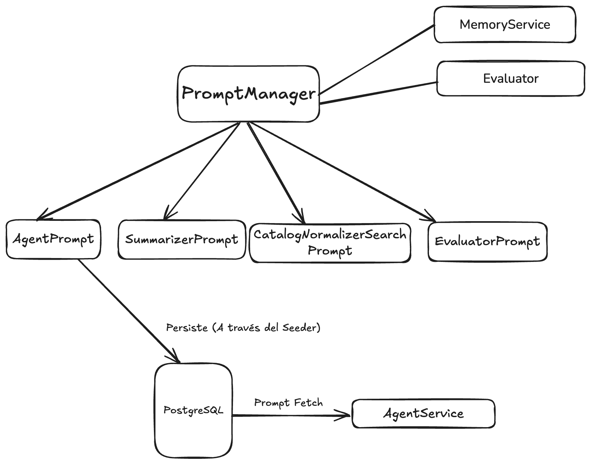

# Proyecto Kavak WhatsApp Bot


## Diagramas del Sistema

A continuación presento los diagramas principales que describen la arquitectura general del sistema y la arquitectura de prompts utilzada.:

### Diagrama de Arquitectura del Sistema



### Diagrama de Flujo de Prompts




## Variables de Entorno (env.example)

Asegúrate de completar el archivo `.env` con las siguientes variables (puedes copiarlo desde `env.example`):

| Variable                   | Descripción                                                      |
|----------------------------|------------------------------------------------------------------|
| LOG_LEVEL                  | Nivel de log (ej: INFO, DEBUG)                                   |
| DATABASE_URL               | Cadena de conexión a la base de datos PostgreSQL                 |
| OPENAI_API_KEY             | API Key de OpenAI para el modelo LLM                             |
| TWILIO_ACCOUNT_SID         | SID de cuenta Twilio (para WhatsApp)                             |
| TWILIO_AUTH_TOKEN          | Token de autenticación Twilio                                    |
| TWILIO_WHATSAPP_NUMBER     | Número de WhatsApp de Twilio                                     |
| MAX_USER_QUERY_TOKENS      | Máximo de tokens por consulta de usuario                         |
| DEFAULT_KAVAK_AGENT_ID     | UUID del agente comercial por defecto                            |
| DEFAULT_DEMO_PHONE_NUMBER  | Teléfono demo para pruebas                                       |
| CHAT_ASSISTANT_MODEL       | Modelo de OpenAI a utilizar por el agente comercial (ej: gpt-4o) |

Completa los valores según tu entorno y credenciales.

## Roadmap y Backlog

Como parte de los entregables se puede el roadmap y backlog del proyecto en el siguiente documento:

[Roadmap, Backlog (PDF)](entregable.pdf)

## Requisitos

- Docker
- Docker Compose
- Python 3.12+ (para desarrollo local)

## Instalación

### 1. Clonar el repositorio

```bash
git clone <URL_DEL_REPOSITORIO>
cd challenge-kavak
```

### 2. Configurar variables de entorno

Copia el archivo de ejemplo y configura las credenciales presentadas:

```bash
cp env.example .env
```

### 3. Buildear y levantar los servicios (DB y API)

```bash
docker-compose up --build -d
```


### 4. Inicializar la base de datos y cargar agente comercial.

Ejecuta los siguientes comandos dentro del contenedor de la API

```bash
# Crear tablas de la base de datos
docker-compose exec api python setup.py database

# Cargar datos iniciales (agente comercial de Kavak)
docker-compose exec api python setup.py seeders
```

### 5. Generar embeddings y cargar información de Kavak

Para generar los embeddings de los autos y cargar la información/Propuesta de valor de Kavak:

```bash
# Generar embeddings de autos desde CSV
docker-compose exec api python setup.py generate-car-embeddings

# Extraer información de Kavak desde el sitio web
docker-compose exec api python setup.py kavak-info-ingestion
```

### 6. Acceso a la API

La API estará disponible en: http://localhost:8000/api/v1

- **Documentación Swagger**: http://localhost:8000/docs
- **Documentación ReDoc**: http://localhost:8000/redoc
- **Health Check**: http://localhost:8000/v1/health
- **Información de la API**: http://localhost:8000/

## Modo Interactivo: Ejecutar el Chat

Para poder interactuar con el agente comercial de Kavak ya sea para desarrollo o prueba se puede ejecutar de manera local usando el script `chat.py`.

### ¿Cómo ejecutarlo?


```bash
docker-compose exec api python interactive_chat.py
```


## Documentación de la API

### Endpoints Principales

#### 1. Enviar Mensaje al Agente
**POST** `/api/v1/chat/send-message`

Envía un mensaje al agente de Kavak y recibe una respuesta.

**Ejemplo de Request:**
```json
{
  "session_id": "fb91b153-86a0-4a17-818e-c44a4c91a4a7",
  "message": "Hola, estoy buscando un auto usado"
}
```

**Ejemplo de Response:**
```json
{
  "success": true,
  "response": "¡Hola! Soy tu asistente de Kavak. Te ayudo a encontrar el auto perfecto. ¿Qué tipo de vehículo estás buscando?",
  "session_id": "fb91b153-86a0-4a17-818e-c44a4c91a4a7",
  "message_id": "msg_123456"
}
```

#### 2. Webhook de WhatsApp
**POST** `/api/v1/whatsapp/webhook`

Endpoint para recibir mensajes de WhatsApp desde Twilio.

**Ejemplo de Request (form-data):**
```
Body: "Hola, quiero comprar un auto"
From: "whatsapp:+525512345678"
```

**Ejemplo de Response:**
```json
{
  "status": "success",
  "message": "Mensaje procesado correctamente"
}
```

#### 3. Listar Todas las Sesiones
**GET** `/api/v1/chat/sessions`

Obtiene todas las sesiones de chat con paginación.

**Ejemplo de Request:**
```
GET /api/v1/chat/sessions?limit=10&offset=0&include_ended=true
```

**Ejemplo de Response:**
```json
[
  {
    "id": "fb91b153-86a0-4a17-818e-c44a4c91a4a7",
    "user_id": "33333333-3333-3333-3333-333333333333",
    "agent_id": "22222222-2222-2222-2222-222222222222",
    "started_at": "2024-01-15T10:30:00Z",
    "ended_at": null
  },
  {
    "id": "a1b2c3d4-e5f6-7890-abcd-ef1234567890",
    "user_id": "44444444-4444-4444-4444-444444444444",
    "agent_id": "22222222-2222-2222-2222-222222222222",
    "started_at": "2024-01-15T09:15:00Z",
    "ended_at": "2024-01-15T10:00:00Z"
  }
]
```

#### 4. Obtener Mensajes de una Sesión
**GET** `/api/v1/chat/sessions/{session_id}/messages`

Obtiene todos los mensajes de una sesión de chat específica.

**Ejemplo de Request:**
```
GET /api/v1/chat/sessions/fb91b153-86a0-4a17-818e-c44a4c91a4a7/messages
```

**Ejemplo de Response:**
```json
[
  {
    "id": "msg_1",
    "session_id": "fb91b153-86a0-4a17-818e-c44a4c91a4a7",
    "role": "user",
    "content": "Hola, estoy buscando un auto usado",
    "created_at": "2024-01-15T10:30:00Z"
  },
  {
    "id": "msg_2",
    "session_id": "fb91b153-86a0-4a17-818e-c44a4c91a4a7",
    "role": "assistant",
    "content": "¡Hola! Soy tu asistente de Kavak. Te ayudo a encontrar el auto perfecto.",
    "created_at": "2024-01-15T10:30:05Z"
  }
]
```

### Documentación Completa

Para ver la documentación completa de todos los endpoints disponibles:

- **Swagger UI**: http://localhost:8000/docs
- **ReDoc**: http://localhost:8000/redoc


Vas a ver un prompt donde puedes escribir mensajes y recibir respuestas del agente. Usa `/quit` o `/exit` para salir del chat.

Esto eliminará todas las tablas y las creará nuevamente desde cero.

## Evaluator (Beta)

El proyecto incluye un **evaluador conversacional**. Este componente permite ejecutar un conjunto de casos simples de prueba definidos en `evaluator/test_cases.json` (a modo de playbook), y delega la evaluación de las respuestas a un agente especializado en análisis conversacional.

El evaluador simula interacciones reales, compara la respuesta del agente con lo esperado y utiliza un LLM para analizar la calidad de la respuesta y el uso de herramientas.

### ¿Cómo ejecutarlo?

Podes correr el evaluador dentro del contenedor de la API con:

```bash
docker-compose exec api python run_evaluator.py
```

### Ejemplo de output

```text
Caso 1: hola
Análisis del evaluador:
✅ El agente se presenta correctamente como agente de ventas de Kavak y no utiliza herramientas.

Caso 2: Tenes disponible un chevrolet onix de menos de 300 mil y con menos 200 mil km
Análisis del evaluador:
✅ El agente responde con información relevante del inventario y utiliza la herramienta 'catalog_search'.

Caso 3: ¿Puedes contarme sobre la historia de Kavak?
Análisis del evaluador:
✅ El agente proporciona información sobre la historia de Kavak y utiliza la herramienta 'kavak_info_search'.
```

### Ejemplo de output JSON

Por cada caso de prueba, el evaluador devuelve un JSON con el análisis detallado:

```json
{
  "tools_match": true,
  "tools_comments": "No hay expected_tools, por lo tanto, las tools invocadas coinciden con las esperadas.",
  "response_match": true,
  "response_comments": "La respuesta del agente es coherente y cumple con lo esperado."
}
```

Podes modificar o agregar casos en `evaluator/test_cases.json` para adaptar el playbook de pruebas.

## Comandos útiles

### Setup.py Commands

El script `setup.py` ahora usa Click y proporciona varios comandos útiles:

```bash
# Ver todos los comandos disponibles
docker-compose exec api python setup.py --help

# Comandos de base de datos
docker-compose exec api python setup.py database              # Crear tablas.
docker-compose exec api python setup.py database --recreate  # Recrear todas las tablas.
docker-compose exec api python seeders.py

# Generar embeddings y datos
docker-compose exec api python setup.py generate-car-embeddings  # Popular la tabla de autos.
docker-compose exec api python setup.py kavak-info-ingestion     # Extraer info de Kavak y generar los embeddings correspondientes.

# Ver ayuda específica de cada comando
docker-compose exec api python setup.py database --help
docker-compose exec api python setup.py generate-car-embeddings --help
docker-compose exec api python setup.py kavak-info-ingestion --help
```

## Troubleshooting

Si tenes problemas:

1. Verifica que Docker y Docker Compose estén instalados y ejecutándose.
2. Revisa los logs con `docker-compose logs`.
3. Asegúrate de que el archivo `.env` esté correctamente configurado. 
4. Revisa estar accediendo mediante el versionado v1 a la api.
5. Verifica haber corrido los scripts de migración y generación de embeddings.

